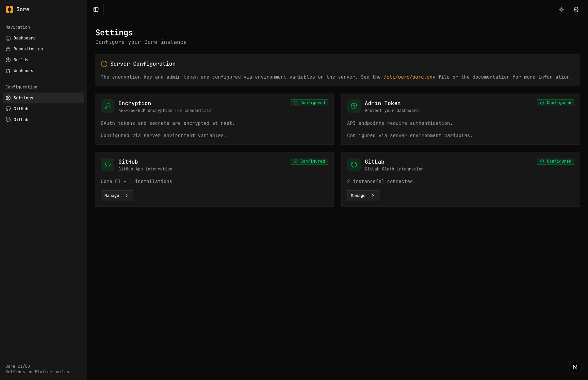

<a href="https://zerodha.tech"></a>

# Oore (`/ɔːr/`)

**Self-hosted CI/CD for Flutter. Your Mac is the server.**

> [!CAUTION]
> **Early development.** Build execution doesn't work yet. Star/watch and check back later.

---

## Prerequisites

**Platform Requirements:**
- macOS 12+ (Monterey or later) — **Required**
- Linux/Windows — **Not supported** (iOS builds require macOS)

**Build Tools (for running builds):**
- Xcode Command Line Tools (`xcode-select --install`)
- Flutter SDK in PATH
- CocoaPods (`sudo gem install cocoapods`)

**Development Dependencies (auto-installed by `./install.local.sh`):**
- Rust 1.70+ with Cargo
- Bun 1.0+
- Git
- OpenSSL

---

## The Idea

With hosted CI (Codemagic, Bitrise, etc.), you upload your signing certificates and provisioning profiles to their cloud. Your code runs on their machines.

**Oore flips this:** Your Mac mini or Mac Studio becomes the CI server. Credentials stay in Keychain. Code never leaves your network. You control it remotely via the web dashboard.

```
┌─────────────────────┐                    ┌─────────────────────────────────────┐
│   Your Laptop       │                    │         Your Mac (the server)        │
│                     │                    │                                      │
│  ┌───────────────┐  │      HTTPS         │  ┌──────────┐    ┌───────────────┐  │
│  │    Browser    │──┼───────────────────▶│  │  oored   │───▶│    Keychain    │  │
│  └───────────────┘  │                    │  │ (server) │    │  certs/profiles│  │
│                     │                    │  └──────────┘    └───────────────┘  │
└─────────────────────┘                    │       │                             │
                                           │       ▼                             │
         GitHub/GitLab ────webhooks───────▶│  ┌──────────┐    ┌───────────────┐  │
                                           │  │  SQLite  │    │   Artifacts    │  │
                                           │  │    DB    │    │   .ipa/.apk    │  │
                                           │  └──────────┘    └───────────────┘  │
                                           └─────────────────────────────────────┘
```

**Two components:**

| Component | What it is | Where it runs |
|-----------|------------|---------------|
| `oored` | HTTP server daemon | **On the Mac** (required) |
| Web dashboard | Browser UI | Anywhere (just needs to reach `oored`) |

The server (`oored`) is the brain. It receives webhooks, runs builds, stores artifacts. The web UI is the remote control — it talks to `oored` over HTTP.

---

## Why Self-Hosted?

| Hosted CI | Oore |
|-----------|------|
| Upload certs to their cloud | Certs stay in your Keychain |
| Code runs on shared VMs | Code runs on your hardware |
| Pay per build minute | Fixed hardware cost |
| Wait in queue | Dedicated resources |
| Trust their security | Trust your own |

---

## Screenshots

> UI exists, but most functionality isn't implemented yet.

| Dashboard | Repositories |
|:---------:|:------------:|
|  |  |

| Builds | Settings |
|:------:|:--------:|
|  |  |

---

## Quick Start

**On your Mac (the server):**

```bash
# Build and install
cargo build --release
sudo ./target/release/oored install

# Configure and start
sudo nano /etc/oore/oore.env
sudo oored start
oored status
```

**Open the web dashboard:**

Navigate to `http://localhost:8080` (or your server's URL) in your browser.

See the [docs](https://oore.build) for full setup instructions.

---

## Project Status

**Very early development.** The core feature (build execution) doesn't exist yet.

| Feature | Status |
|---------|--------|
| GitHub/GitLab webhooks | ✅ Works |
| Repository management | ✅ Works |
| Service management | ✅ Works |
| REST API | ✅ Works |
| Web dashboard | ✅ Shell only |
| **Build execution** | ❌ Not started |
| Code signing | ❌ Not started |
| Artifact storage | ❌ Not started |
| App Store publishing | ❌ Not started |

---

## Documentation

- [Quick Start](https://oore.build/quickstart/)
- [Configuration](https://oore.build/configuration/)
- [API Reference](https://oore.build/reference/api/)
- [Architecture](https://oore.build/architecture/)
- [GitHub Integration](https://oore.build/integrations/github/)
- [GitLab Integration](https://oore.build/integrations/gitlab/)

---

## Contributing

Contributions are welcome! Here's how to get started:

```bash
# 1. Fork and clone
git clone https://github.com/YOUR_USERNAME/oore.build.git
cd oore.build

# 2. Setup development environment
make setup

# 3. Run server + web together
make dev
```

**Before you contribute:**

| Document | Purpose |
|----------|---------|
| [CONTRIBUTING.md](CONTRIBUTING.md) | Workflow, code standards, PR process |
| [CODE_OF_CONDUCT.md](CODE_OF_CONDUCT.md) | Community guidelines |
| [ROADMAP.md](ROADMAP.md) | What's planned, what's not |
| [documentation/TESTING.md](documentation/TESTING.md) | Testing requirements |

**Quick links for contributors:**

- Run tests: `cargo test`
- Lint: `cargo clippy`
- Format: `cargo fmt`
- Regenerate TS types: `make types`
- All commands: `make help`

---

## Why "Oore"?

**Ore** is raw material — valuable, but unusable until refined.

Your source code is the ore. Oore is the refinery that turns it into signed, distributable artifacts.

---

## License

MIT

---

**[Aryakumar Jha](https://github.com/devaryakjha)** · [Zerodha](https://zerodha.tech)
