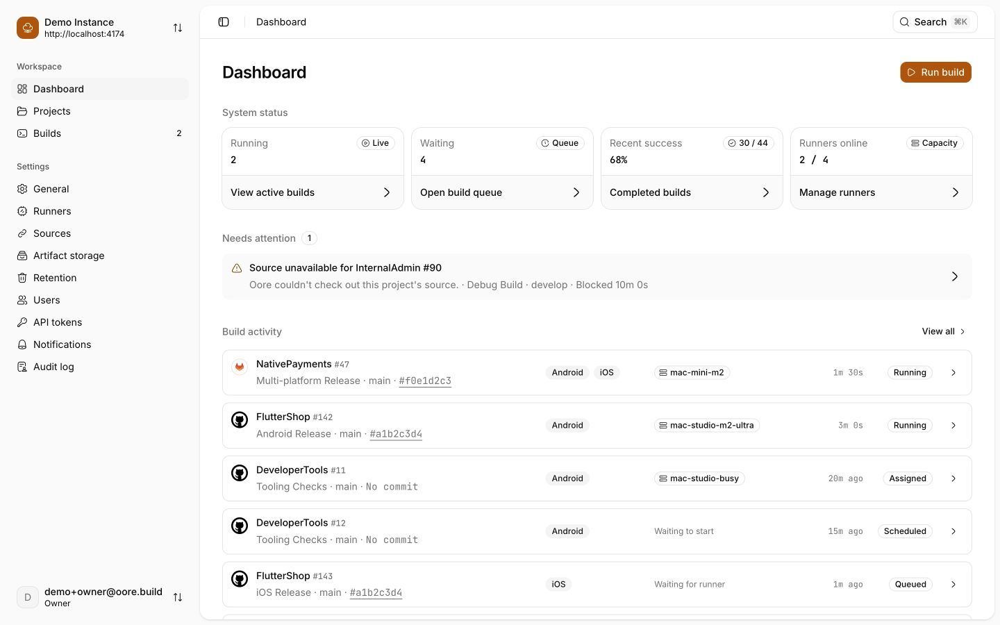
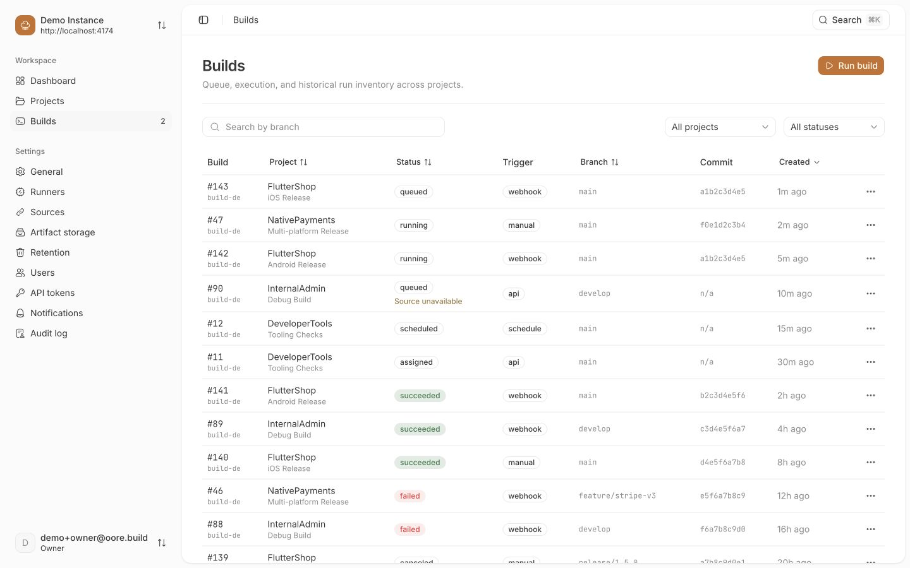

<p align="center">
  
</p>

<h1 align="center">Oore CI</h1>

<p align="center">Self-hosted mobile CI and internal app distribution platform.</p>

<p align="center">
  <a href="https://docs.oore.build">Documentation</a>
  ·
  <a href="https://demo.oore.build">Live Demo</a>
  ·
  <a href="https://ci.oore.build">Hosted UI</a>
</p>

<p align="center">
  <a href="https://zerodha.tech"></a>
  <br />
  <a href="https://github.com/oore-ci/oore.build/actions/workflows/validate.yml"></a>
</p>

> **Alpha** — Oore CI is under active development. APIs, config formats, and CLI flags will change without notice. Use at your own risk.

> Want a quick product tour before installing? Open the live demo: [demo.oore.build](https://demo.oore.build)

## What is this?

Oore CI lets you run your own mobile CI server. V1 targets Android, iOS, and macOS Flutter builds on a macOS host. It provides:

- A **daemon** (`oored`) that orchestrates builds and serves the API
- An **operator CLI** (`oore`) for setup, admin, and runner management
- A **web UI** for managing builds, apps, and team access
- **OIDC authentication for non-loopback access** — no local passwords (loopback-only local login supported for local-first onboarding)

## Screenshots

| Dashboards                                                                    | Builds                                                                       |
| ----------------------------------------------------------------------------- | ---------------------------------------------------------------------------- |
|  |  |

Try the live demo first: [demo.oore.build](https://demo.oore.build)

## Prerequisites

- macOS (backend requirement for V1)
- `curl`, `tar`, and `shasum` (for release installer)

For source development, also install [Rust](https://rustup.rs/) and [Bun](https://bun.sh/).

## Quick Start

```bash
# Download and inspect the fallback installer.
curl -fL https://oore.build/install -o oore-install.sh
less oore-install.sh
bash oore-install.sh
```

Public alpha onboarding and support:

- [Start with Oore](https://docs.oore.build/start)
- [Report an issue](https://docs.oore.build/operate/support/report-an-issue)
- [Known limitations](https://docs.oore.build/operate/known-limitations)
- [Live demo (no install)](https://demo.oore.build)

Install prerelease channels:

```bash
# Latest alpha
OORE_CHANNEL=alpha bash oore-install.sh

# Latest beta
OORE_CHANNEL=beta bash oore-install.sh
```

Update in-place:

```bash
oore update --check
oore update
```

Then complete setup using one of these paths:

- Hosted UI: open [ci.oore.build](https://ci.oore.build) and add an **HTTPS-reachable** backend URL
- Local-only backend:
  - run `oore setup` from CLI, or
  - run bundled local frontend `oore-web --backend-url http://127.0.0.1:8787`, or
  - expose backend through a tunnel and continue in hosted UI

Detailed setup docs: [docs.oore.build](https://docs.oore.build)

## Development (from source)

```bash
bun install

make clean-dev-state  # Wipe isolated dev data (~/.oore/dev.noindex)
make run-daemon       # Start oored with isolated dev data
make run-cli          # Generate setup token against dev DB
make dev-fresh-setup  # Clean dev state, local build, start daemon, start tunnel, generate setup token
make dev-web          # Local web UI (http://localhost:3000)
```

Notes:

- `make dev-fresh-setup` starts a Cloudflare quick tunnel by default and prints the assigned public URL.
- Disable the tunnel with `OORE_DEV_ENABLE_TUNNEL=0 make dev-fresh-setup`.
- `make dev-fresh-setup` runs token-only setup by default for hosted UI E2E.
- Use `OORE_DEV_SETUP_MODE=cli make dev-fresh-setup` only when you explicitly want CLI-driven OIDC setup.
- Dev state uses a `.noindex` directory and writes `.metadata_never_index` to reduce Spotlight indexing load on macOS.
- `make clean-dev-state` also stops the matching dev daemon and Cloudflare tunnel for the configured dev URL/port before deleting state.
- `make run-daemon*` targets use an isolated dev data root (`~/.oore/dev.noindex`) so local source runs do not collide with production daemon data.

## Project Structure

```
apps/web/           React 19 + TanStack Router (product UI)
apps/docs/          Astro 7 + Fumadocs static documentation
apps/site/          Neutral landing/install site (`oore.build`)
crates/oored/       Daemon — Axum HTTP server
crates/oore/        Operator CLI — Clap
crates/oore-runner/ Build runner agent
crates/oore-contract/ Shared data types (Serde structs)
```

## Releases (macOS, Automated)

Releases are published via GitHub Actions.

High-level flow:

- PR/push validation -> CI runs frontend/docs (Linux) and Rust (macOS) checks in parallel
- Merge to `alpha` -> CI cuts `vX.Y.Z-alpha.N` tags (prerelease)
- Merge to `beta` -> CI cuts `vX.Y.Z-beta.N` tags (prerelease)
- Merge to `stable` -> CI cuts `vX.Y.Z` tags (stable), auto-incrementing patch when needed
- Tag push -> CI builds macOS artifacts (arm64 + x86_64), deploys Pages targets (`oore`, `oore-docs`, `oore-ci`, `oore-demo`), and publishes a GitHub Release with attached artifacts

Major/minor bumps are done by updating `Cargo.toml` `workspace.package.version` (for example `0.2.0`), then continuing the alpha -> beta -> stable promotion flow.

## Contributing

- **Guidelines**: See [CONTRIBUTING.md](CONTRIBUTING.md) for how to submit PRs, code style, and testing.
- **Code of Conduct**: Review [CODE_OF_CONDUCT.md](CODE_OF_CONDUCT.md) for community expectations.
- **Support & Reporting**: Use [SUPPORT.md](SUPPORT.md) for troubleshooting, bug reports, and feature requests.
- **Known alpha limitations**: Refer to [Known limitations](https://docs.oore.build/operate/known-limitations) for current constraints.

## License

[MIT](LICENSE)
